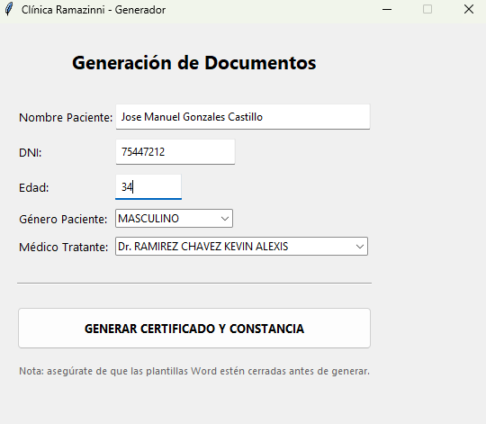

# Generador de Documentos Clínicos Automatizado 🏥

Aplicación de escritorio desarrollada en Python para automatizar la creación de Certificados Médicos y Constancias (Solo para uso exclusivo de la Clinica Ramazinni por sus Constancias y Certificados de Carnet de Sanidad), reduciendo el trabajo manual y minimizando errores humanos en la clínica.

## 🚀 Características
- **Interfaz Gráfica (GUI):** Fácil de usar, desarrollada con Tkinter.
- **Automatización Lógica:**
  - Detecta género del paciente para asignar términos ("Sana"/"Sano", "Sr."/"Sra.").
  - Ajusta la redacción legal según el género del médico ("El que suscribe" / "La que suscribe").
- **Generación Word:** Utiliza plantillas `.docx` reales para mantener el diseño original de la clínica.
- **Gestión de Archivos:** Crea y organiza automáticamente los documentos en carpetas.

## 🛠️ Tecnologías
- **Python 3.x**
- **Tkinter** (Interfaz gráfica)
- **DocxTpl** (Motor de plantillas Jinja2 para Word)
- **PyInstaller** (Para compilación a .exe)

    